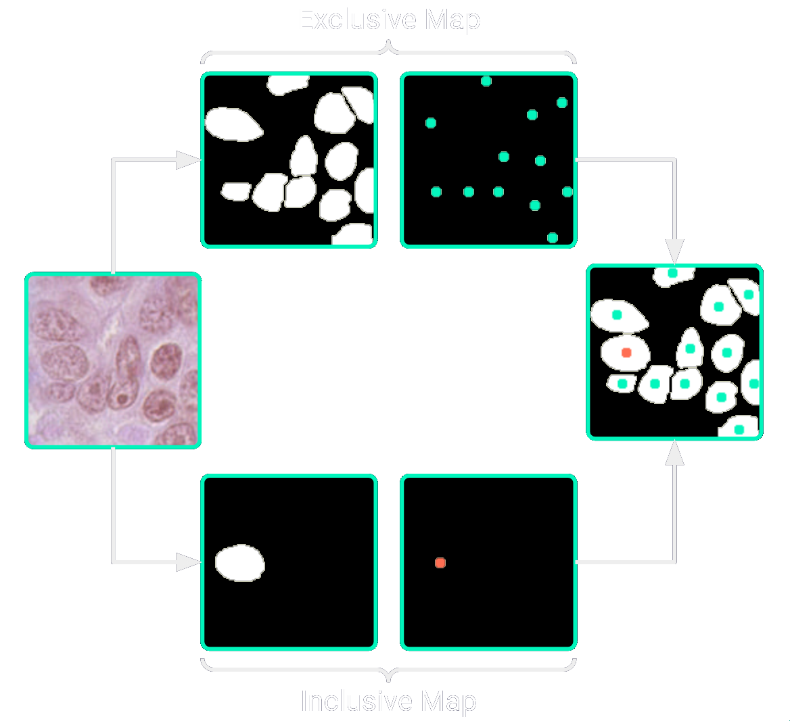

## Die Methode hinter der interaktiven Segmentation

Die Basis hinter dem Ansatz stellt [Koohbanani et al.](https://arxiv.org/pdf/2005.14511) . Hierfür werden sogenannte Inclusion Maps und Exclusion Maps als Leitlinien genutzt, um präzise und effiziente Segmentierungen zu erzeugen – und das mit minimalem Benutzereingriff. 

  

---

### Inclusion Map 

Die Inclusion Map wird erstellt, indem ein Benutzer innerhalb eines Zellkerns klickt. Dieser Klick erzeugt eine Karte, bei der der geklickte Punkt auf "1" gesetzt wird, während alle anderen Pixel den Wert "0" erhalten. Diese Karte hilft dem Modell, den genauen Bereich des Zellkerns zu erkennen, auf den sich der Benutzer konzentrieren möchte. Wenn beispielsweise nur ein Kern segmentiert werden soll, reicht die Inclusion Map als Leitlinie.

---

### Exclusion Map

In Szenarien, in denen mehrere Zellkerne dicht beieinander liegen, wird zusätzlich eine Exclusion Map erstellt. Diese Karte hebt alle anderen Zellkerne im ausgewählten Bildausschnitt hervor und markiert sie ebenfalls mit "1", während alle anderen Pixel den Wert "0" behalten. Diese Karte ist besonders nützlich in Regionen mit vielen Zellkernen, da sie dem Modell hilft, zwischen dicht gepackten Kernen zu unterscheiden und diese sauber voneinander zu trennen. So kann der Benutzer sicherstellen, dass die Segmentierung präzise und ohne Überlappungen zwischen den Kernen erfolgt.
Vorteile im Training und der Robustheit

---

### Während des Trainings
Im Training werden die Inclusion- und Exclusion Maps variiert, indem der Punkt für die Inclusion Map zufällig innerhalb des Kerns gewählt wird. Dieser Punkt hat dabei einen Mindestabstand zu den Randpixeln, was die Flexibilität des Modells erhöht und verhindert, dass das Modell auf exakte Klickpositionen angewiesen ist. Die Exclusion Map wird basierend auf den Zentren der anderen Kerne erstellt, um das Modell robust gegen Variationen in den Eingabemustern zu machen. Dadurch lernt das Modell, auch dann eine präzise Segmentierung durchzuführen, wenn der Klick nicht exakt im Kernzentrum liegt.

---

### Ergebnisse

Die im Rahmen dieses Projekts entwickelten Eff-UTransNet-Architekturen übertreffen derzeit alle vergleichbaren Modelle. Der zugrunde liegende Datensatz wurde speziell für dieses Projekt kuratiert und umfasst 56.130 Trainingsbilder mit zugehörigen Masken sowie 9.905 Testbilder mit entsprechenden Masken. Die Modelle wurden auf Patches der Größe 128x128 trainiert, was dem Standard dieser Methode entspricht. In der folgenden Tabelle sind die Ergebnisse einiger eigens entwickelter Modelle im Vergleich zu anderen Modellen aus der Literatur dargestellt.

| Model               | Dice          | Jaccard       | F1           | Parameters     |
|---------------------|---------------|---------------|--------------|----------------|
| Nuclick             | 84.11         | 85.42         | 74.57        | 66,800,321     |
| UNet| 84.61         | 85.61        | 74.85          | 12,583,425     |
| NucDep              | 85.39         | 86.65         | 76.46        | 69,944,961     |
| UDTransNet          | 86.46         | 87.88         | 78.41        | 33,799,617     |
| Eff-SepUTransNet | 86.9 | 88.2          | 78.92          | 12,845,537 |
| Eff-SepResUTransNet | **87.64** | **89.01** | **80.22**     | 37,751,681     |

