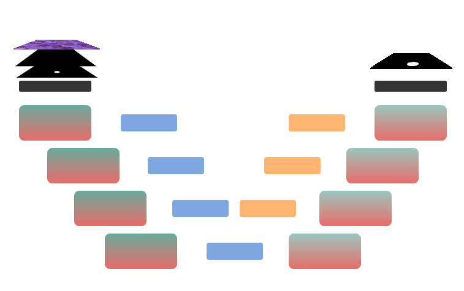

  

### Architektur

Die Architektur des Eff-ResSepUTransNet basiert auf einem Encoder-Decoder-Modell mit einem U-Net-ähnlichen Verlauf. Neben klassischen CNN-Blöcken sind Transformer-Blöcke sowie vortrainierte Layer integriert.

---

## Encoder

Zu Beginn wird eine einfache 2D-Convolution auf die Eingabe angewandt, um sie in das geeignete Format zu bringen. Anschließend werden abwechselnd Depthwise-Separable-Convolutions und optional Attention-Mechanismen eingesetzt, um die Features zu extrahieren und den Featurespace schrittweise zu erweitern. Die Ausgabe eines Blocks dient jeweils als Eingabe für den darunterliegenden Block. Diese Layer-Anordnung führt zu einem leistungsfähigen Segmentationsmodell, das dennoch schnell ist und eine geringe Anzahl an Parametern benötigt.

---

## Bridge

Der Brückenabschnitt enthält zusätzliche Layer, die in herkömmlichen Architekturen meist nicht vorkommen. Hier sind ein Transformer-Layer und ein darauf folgender vortrainierter Layer integriert. Diese Struktur ermöglicht eine tiefere Extraktion relevanter Merkmale und erhöht die Stabilität des Modells.

---

## Decoder

Der Decoder setzt sich aus doppelten Convolutions und optionaler Attention zusammen. Er verarbeitet die Features aus den Decoder-Blöcken und der Bridge und generiert daraus die gewünschte Ausgabe. Auf jeder Stufe wird die Ausgabe in Höhe und Breite jeweils verdoppelt. Abschließend wird ein letzter Convolutional Layer angewandt, um die Endausgabe zu erzeugen.

---

## Variationen

Durch die flexible Struktur des Modells lassen sich vielfältige Anpassungen und Kombinationen der Schichten realisieren, sodass das Modell auf unterschiedliche Anforderungen hin optimiert werden kann.
