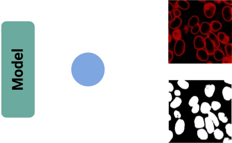
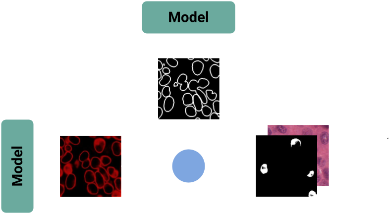

  

### Funktionsweise des Unsicherheitsmodells

Um den Nutzern eine präzisere und schnellere Analyse zu ermöglichen, habe ich ein neues Verfahren entwickelt, das neben einer herkömmlichen Segmentationsmaske auch eine Unsicherheitsmaske ausgibt. Diese Maske hebt alle Bereiche hervor, in denen sich das Modell bezüglich der Segmentierung unsicher ist. Dafür wurde eine Variante des Eff-ResSepUTransNet mit mehreren Ausgabeköpfen entwickelt. Zusätzlich entstand ein Netzwerk, das als Ausgabeschicht ein weiteres Netzwerk verwendet und somit ein "zwei-in-eins-Netzwerk" bildet. Dieses Modell generiert sowohl eine herkömmliche Segmentationsmaske als auch eine Unsicherheitsmaske. Für das Training dieser Modelle wurde eine speziell angepasste Loss-Funktion entwickelt, die die präzise Generierung beider Masken sicherstellt.

## Erstellung der Maske

Bei der Segmentierung von Zellkernen und anderen Objekten nimmt die Aktivierung des Modells an den Rändern der Objekte oft ab, wodurch Unsicherheiten in diesen Randbereichen auf der Ausgabemaske deutlich sichtbar werden. Daher sind einige Preprocessing-Schritte notwendig, um eine präzisere Vorhersage zu treffen. Der wichtigste Schritt ist die Subtraktion einer Randmaske von der Unsicherheitsmaske. Diese Randmaske kann entweder von einem Modell erzeugt oder aus der semantischen Ausgabe durch einen Algorithmus generiert werden. Dadurch werden alle überlappenden Aktivierungen neutralisiert. Um mögliche kleinere Fehler zu beheben, wird die Maske anschließend erodiert und einer Schwellenwertprüfung unterzogen, um nur die genauen Werte zu erhalten. Auf diese Weise entsteht eine Maske, die die schwierigsten Bereiche zur Segmentierung markiert. Dies kann den Nutzern als Unterstützung dienen oder eine unguided-Segmentierung mit feineren guided-Segmentierungsschritten ermöglichen, was die bestmöglichen Ergebnisse liefert.
