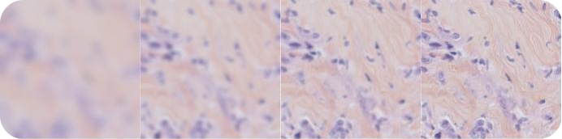

### Autofokus im Überblick

Eine der wichtigsten Eigenschaften eines analysierbaren Bildes ist die Schärfe und die klare Differenzierbarkeit der Objekte. Digitale Mikroskope verwenden hierfür in der Regel einen Autofokus-Algorithmus. Dieser stößt jedoch insbesondere bei pathologischen Aufnahmen häufig an seine Grenzen, da solche Bilder oft sehr kontrastreich sind und mehrere Schichten aufweisen können. Ein KI-gestützter Autofokus, der eigenständig erkennt, wann ein Bild im Fokus ist, stellt daher eine schnellere und bessere Alternative dar.

---

### Autofokus-Methode

Der Autofokus von SeesDisease nutzt ein kleines, aber hochpräzises [Netzwerk](https://arxiv.org/pdf/2106.04803), das den aktuellen Fokusstatus des Bildes klassifiziert. Basierend auf dieser Klassifikation kommt ein Suchalgorithmus zum Einsatz, der iterativ den optimalen Fokuspunkt ansteuert. Der Algorithmus stoppt, sobald das Modell den besten Fokus erkennt oder ein bestimmter Schwellenwert überschritten wird. Für diese Methode wurde ein Datensatz pathologischer Aufnahmen mit verschiedenen Fokusstufen erstellt sowie ein Suchalgorithmus entwickelt, der die Z-Achse eines digitalen Mikroskops gezielt anpasst. Dieser Autofokus ist in jedes Mikroskop integrierbar, das durch ein Verbindungskabel oder Betriebssystem steuerbar ist.

